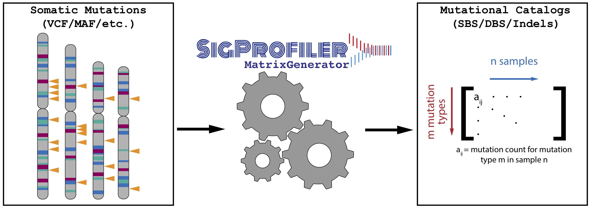

[](https://osf.io/s93d5/wiki/home/) [](https://opensource.org/licenses/BSD-2-Clause) [](https://app.travis-ci.com/AlexandrovLab/SigProfilerMatrixGenerator)
[](https://stats.uptimerobot.com/jjqW4Ulymx)

# SigProfilerMatrixGenerator
SigProfilerMatrixGenerator creates mutational matrices for all types of somatic mutations. It allows downsizing the generated mutations only to parts of the genome (e.g., exome or a custom BED file). The tool seamlessly integrates with other SigProfiler tools.

**INTRODUCTION**

The purpose of this document is to provide a guide for using the SigProfilerMatrixGenerator framework to generate mutational matrices for a set of samples with associated mutational catalogues. An extensive Wiki page detailing the usage of this tool can be found at https://osf.io/s93d5/wiki/home/.

For users that prefer working in an R environment, a wrapper package is provided and can be found and installed from: https://github.com/AlexandrovLab/SigProfilerMatrixGeneratorR



**PREREQUISITES**

The framework is written in PYTHON, however, it also requires the following software with the given versions (or newer):

  * PYTHON          version 3.8 or newer
  * WGET                   version 1.9  or RSYNC if you have a firewall

By default the installation process will save the FASTA files for all chromosomes for the default genome
assemblies (GRCh37, GRCH38, mm10, mm9, rn6). As a result, ~3 Gb of storage must be available for the downloads for each genome.

**QUICK START GUIDE**

#### Using Python Interface:
This section will guide you through the minimum steps required to create mutational matrices:
1. Install the python package using pip:
    ```bash
    pip install SigProfilerMatrixGenerator
    ```
2. Install your desired reference genome from the command line/terminal as follows (a complete list of supported genomes can be found below):
    ```python
    $ python
    >> from SigProfilerMatrixGenerator import install as genInstall
    >> genInstall.install('GRCh37', rsync=False, bash=True)
    ```
        This will install the human 37 assembly as a reference genome. You may install as many genomes as you wish. If you have a firewall on your server, you may need to install rsync and use the rsync=True parameter. Similarly, if you do not have bash,
        use bash=False.
3. Place your vcf files in your desired output folder. It is recommended that you name this folder based on your project's name
4. From within a python session, you can now generate the matrices as follows:
    ```python
    $ python3
    >>from SigProfilerMatrixGenerator.scripts import SigProfilerMatrixGeneratorFunc as matGen
    >>matrices = matGen.SigProfilerMatrixGeneratorFunc("test", "GRCh37", "/Users/ebergstr/Desktop/test",plot=True, exome=False, bed_file=None, chrom_based=False, tsb_stat=False, seqInfo=False, cushion=100)
    ```
  The required parameters are as follows:
  ```python
  SigProfilerMatrixGeneratorFunc(project, reference_genome, path_to_input_files)
  ```

#### Using Command Line Interface (CLI):
1. After installing the package, you can directly call the tool using:
    ```bash
    SigProfilerMatrixGenerator <function-name> <arguments>
    ```
    Currently supported functions are 'install' and 'matrix_generator'.

2. For example, to install a reference genome:
    ```bash
    SigProfilerMatrixGenerator install GRCh37
    ```

3. To generate SBS, DBS, or INDEL matrices:
    ```bash
    SigProfilerMatrixGenerator matrix_generator <project> <reference_genome> <path_to_input_files>
    ```

View the table below for the full list of parameters.

**PARAMETERS**
| Category | Parameter | Variable Type | Parameter Description |
| ------ | ----------- | ----------- | ----------- |
| Required |  |  |  |
|  | project | String | The name of the project. |
|  | reference_genome | String | The name of the reference genome. Full list of genomes under **Supported Genomes** section. Supported values include the following: {c_elegans, dog, ebv, GRCh37, GRCh38, mm9, mm10, mm39, rn6, yeast} |
|  | path_to_input_files | String | The path to the input files. |
| Optional |  |  |  |
|  | exome | Boolean | Downsamples mutational matrices to the exome regions of the genome. Default value False. |
|  | bed_file | String | Downsamples mutational matrices to custom regions of the genome. Requires the full path to the BED file. Default value None. Note: BED file header is required. |
|  | chrom_based | Boolean | Outputs chromosome-based matrices. Default value False. |
|  | plot | Boolean | Integrates with SigProfilerPlotting to output all available visualizations for each matrix. Default value False. |
|  | tsb_stat | Boolean | Outputs the results of a transcriptional strand bias test for the respective matrices. Default value False. |
|  | seqInfo | Boolean | Ouputs original mutations into a text file that contains the SigProfilerMatrixGenerator classificaiton for each mutation. Default value True. |
|  | cushion | Integer | Adds an Xbp cushion to the exome/bed_file ranges for downsampling the mutations. Default value 100. |
|  | volume | String | Path to SigProfilerMatrixGenerator's volume where reference genomes will be saved and loaded from. Useful for docker installations. Default is None. |


**INPUT FILE FORMAT**

This tool currently supports maf, vcf, simple text file, and ICGC formats. The user must provide variant data adhering to one of these four formats. If the user’s files are in vcf format, each sample must be saved as a separate files.


**OUTPUT FILE STRUCTURE**

The output structure is divided into three folders: input, output, and logs. The input folder contains copies of the user-provided input files. The outputfolder contains
a DBS, SBS, ID, and TSB folder (there will also be a plots folder if this parameter is chosen). The matrices are saved into the appropriate folders. The logs folder contains the error and log files for the submitted job.

## STRUCTURAL VARIANT MATRIX GENERATION

### INPUT FORMAT:

***First six columns are required, and either the column "svclass" (deletion, translocation, tandem-duplication, or inversion) or the columns "strand1" & "strand2" (BRASS convention) must also be present***


### Example with SV class present (tsv or csv file):

| chrom1 | start1 | end1 | chrom2 | start2 | end2 | svclass |
| :-----: | :-: | :-: | :-: | :-: | :-: | :-: |
| 19 | 21268384 | 21268385 | 19 | 21327858 | 21327859 | deletion

### Example without SV class present (tsv or csv file):

| chrom1 | start1 | end1 | chrom2 | start2 | end2 | strand1 | strand2
| :-----: | :-: | :-: | :-: | :-: | :-: | :-: | :-: |
| 19 | 21268384 | 21268385 | 19 | 21327858 | 21327859 | + | +

### Quick Start Example: ###

```
#navigate to SVMatrixGenerator directory and start python3 interpreter

from SigProfilerMatrixGenerator.scripts import SVMatrixGenerator as sv
input_dir = "./SigProfilerMatrixGenerator/references/SV/example_input/560-Breast" #directory which contains collection of bedpe files (one per sample)
output_dir = "./SigProfilerMatrixGenerator/references/SV/"
project = "560-Breast"
sv.generateSVMatrix(input_dir, project, output_dir)
```
**Alternatively, you can run directly from the command line:**
```
python3 ./SigProfilerMatrixGenerator/scripts/SVMatrixGenerator.py ./SigProfilerMatrixGenerator/references/SV/example_input/560-Breast 560-Breast ./SigProfilerMatrixGenerator/references/SV/example_output/ #provide input_dir, project, output_dir as command-line arguments
```
## OUTPUT:
1. Annotated bedpe file - a file with each SV annotated with its type, size bin, and clustered/non-clustered status
2. Aggregate SV plot - a summary plot showing the average number of events in each channel for the whole cohort of samples
3. SV Matrix - a 32 X n matrix (where n is the number of samples) that can be used to perform signature decomposition, clustering, etc.

## COPY NUMBER MATRIX GENERATION

In order to generate a copy number matrix, provide the an absolute path to a multi-sample segmentation file obtained from one of the following copy number calling tools (if you have individual sample files, please combine them into one file with the first column corresponding to the sample name):

1. ASCAT
2. ASCAT_NGS
3. SEQUENZA
4. ABSOLUTE
5. BATTENBERG
6. FACETS
7. PURPLE
8. TCGA

In addition, provide the name of the project and the output directory for the resulting matrix. The final matrix will be placed in a folder with the name of the project in the directory specified by the output path.

**An example to generate the CNV matrix is as follows:**

$ python3
```
>>from SigProfilerMatrixGenerator.scripts import CNVMatrixGenerator as scna
>>file_type = "BATTENBERG"
>>input_file = "./SigProfilerMatrixGenerator/references/CNV/example_input/Battenberg_test.tsv" #example input file for testing
>>output_path = "/Users/azhark/iCloud/dev/CNVMatrixGenerator/example_output/"
>>project = "Battenberg_test"
>>scna.generateCNVMatrix(file_type, input_file, project, output_path)

```

**Alternatively, you can run directly from the command line:**

```
python ./SigProfilerMatrixGenerator/scripts/CNVMatrixGenerator.py BATTENBERG ./SigProfilerMatrixGenerator/references/CNV/example_input/Battenberg_test.tsv BATTENBERG-TEST ./SigProfilerMatrixGenerator/references/CNV/example_output/
```

**SUPPORTED GENOMES**

This tool currently supports the following genomes:

GRCh38.p12 [GRCh38] (Genome Reference Consortium Human Reference 38), INSDC
Assembly GCA_000001405.27, Dec 2013. Released July 2014. Last updated January 2018. This genome was downloaded from ENSEMBL database version 93.38.

GRCh37.p13 [GRCh37] (Genome Reference Consortium Human Reference 37), INSDC
Assembly GCA_000001405.14, Feb 2009. Released April 2011. Last updated September 2013. This genome was downloaded from ENSEMBL database version 93.37.

GRCm39 [mm39] (Genome Reference Consortium Mouse Reference 39), INSDC
Assembly GCA_000001635.9, Jun 2020. Last updated August 2020. This genome was downloaded from ENSEMBL database version 103.

GRCm38.p6 [mm10] (Genome Reference Consortium Mouse Reference 38), INDSDC
Assembly GCA_000001635.8, Jan 2012. Released July 2012. Last updated March 2018. This genome was downloaded from ENSEMBL database version 93.38.

GRCm37 [mm9] (Release 67, NCBIM37), INDSDC Assembly GCA_000001635.18.
Released Jan 2011. Last updated March 2012. This genome was downloaded from ENSEMBL database version release 67.

Rnor_6.0 [rn6] INSDC Assembly GCA_000001895.4, Jul 2014. Released Jun 2015. Last updated Jan 2017.
This genome was downloaded from ENSEMBL database version 96.6.

Epstein-Barr Virus [EBV] NC_007605.1, Nov 2005. Last updated Aug 2018. This genome was downloaded from the NCBI database: https://www.ncbi.nlm.nih.gov/nuccore/82503188/.

CanFam3.1 [dog] GCA_000002285.2, Sep 2011. Last updated Jun 2019. This genome was downloaded from ENSEMBL database version 100.

WBcel235 [c_elegans] GCA_000002985.3, Oct 2014. Last updated Jan 2019. This genome was downloaded from ENSEMBL database version 100.

*One can specify "_havana" to the end of the genome to include annotations in t-cell receptor genes and IG clusters (available for GRCh37, GRCh38, and mm10).

**LOG FILES**

All errors and progress checkpoints are saved into *sigProfilerMatrixGenerator_[project]_[genome].err* and *sigProfilerMatrixGenerator_[project]_[genome].out*, respectively.
For all errors, please email the error and progress log files to the primary contact under CONTACT INFORMATION.

**UNIT TESTS**

Unit tests can be run with the following commands:

```bash
python setup.py sdist
pip install .[tests]
pytest tests
```

**END-TO-END TESTS**

An integration test can be run with the following commands:

```bash
wget ftp://alexandrovlab-ftp.ucsd.edu/pub/tools/SigProfilerMatrixGenerator/GRCh37.tar.gz -P ./src/
pip install .
SigProfilerMatrixGenerator install GRCh37
python3 test.py -t GRCh37
```

**CITATION**

For SBSs, DBSs, and INDELs, please cite the following paper:

Bergstrom EN, Huang MN, Mahto U, Barnes M, Stratton MR, Rozen SG, and Alexandrov LB (2019) SigProfilerMatrixGenerator: a tool for visualizing and exploring patterns of small mutational events. **BMC Genomics** 20, Article number: 685.
https://bmcgenomics.biomedcentral.com/articles/10.1186/s12864-019-6041-2

For SVs and CNVs, please cite the following paper:

Khandekar A, Vangara R, Barnes M, Díaz-Gay M, Abbasi A, Bergstrom EN, Steele CD, Pillay N, and Alexandrov LB (2023) Visualizing and exploring patterns of large mutational events with SigProfilerMatrixGenerator. **BMC Genomics** 24, Article number: 469.
https://doi.org/10.1186/s12864-023-09584-y

**COPYRIGHT**

Copyright (c) 2019, Erik Bergstrom [Alexandrov Lab] All rights reserved.

Redistribution and use in source and binary forms, with or without modification, are permitted provided that the following conditions are met:

Redistributions of source code must retain the above copyright notice, this list of conditions and the following disclaimer.

Redistributions in binary form must reproduce the above copyright notice, this list of conditions and the following disclaimer in the documentation and/or other materials provided with the distribution.

THIS SOFTWARE IS PROVIDED BY THE COPYRIGHT HOLDERS AND CONTRIBUTORS "AS IS" AND ANY EXPRESS OR IMPLIED WARRANTIES, INCLUDING, BUT NOT LIMITED TO, THE IMPLIED WARRANTIES OF MERCHANTABILITY AND FITNESS FOR A PARTICULAR PURPOSE ARE DISCLAIMED. IN NO EVENT SHALL THE COPYRIGHT HOLDER OR CONTRIBUTORS BE LIABLE FOR ANY DIRECT, INDIRECT, INCIDENTAL, SPECIAL, EXEMPLARY, OR CONSEQUENTIAL DAMAGES (INCLUDING, BUT NOT LIMITED TO, PROCUREMENT OF SUBSTITUTE GOODS OR SERVICES; LOSS OF USE, DATA, OR PROFITS; OR BUSINESS INTERRUPTION) HOWEVER CAUSED AND ON ANY THEORY OF LIABILITY, WHETHER IN CONTRACT, STRICT LIABILITY, OR TORT (INCLUDING NEGLIGENCE OR OTHERWISE) ARISING IN ANY WAY OUT OF THE USE OF THIS SOFTWARE, EVEN IF ADVISED OF THE POSSIBILITY OF SUCH DAMAGE.

**CONTACT INFORMATION**

Please address any queries or bug reports to Erik Bergstrom at ebergstr@eng.ucsd.edu. Please address any queries or bug reports related to CNV's or SV's to Azhar Khandekar at akhandek@eng.ucsd.edu. Additional support can be provided by Mark Barnes at mdbarnes@health.ucsd.edu.
